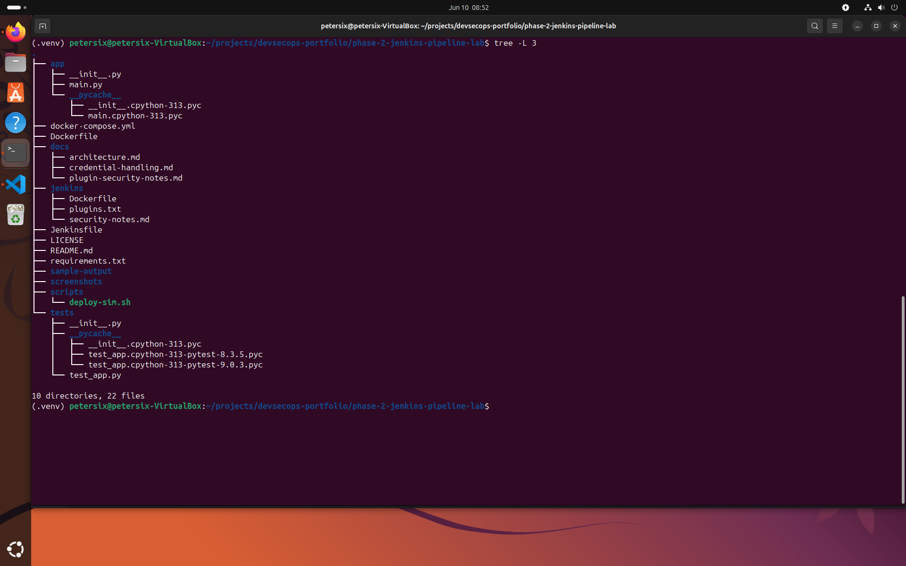
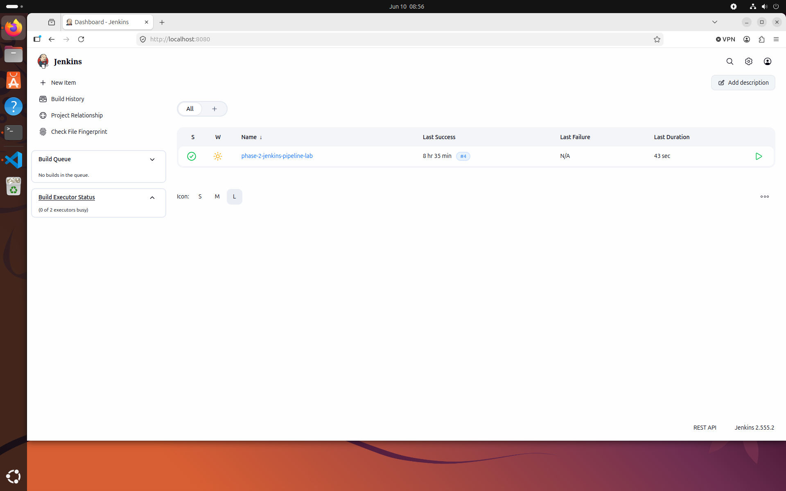
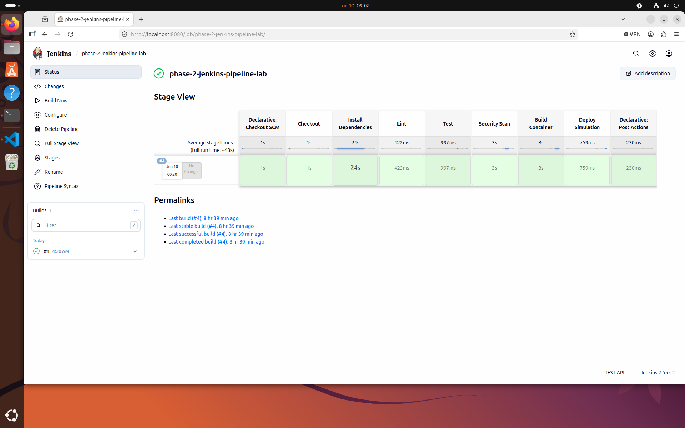
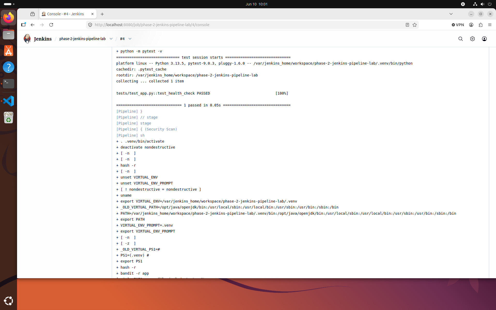
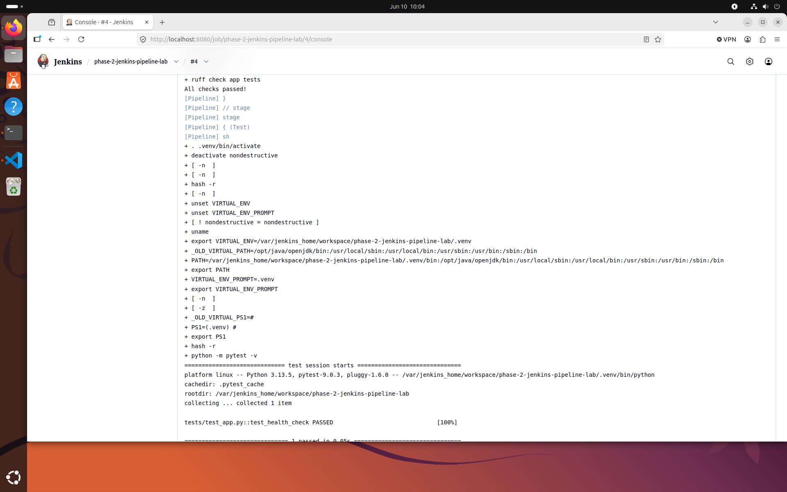
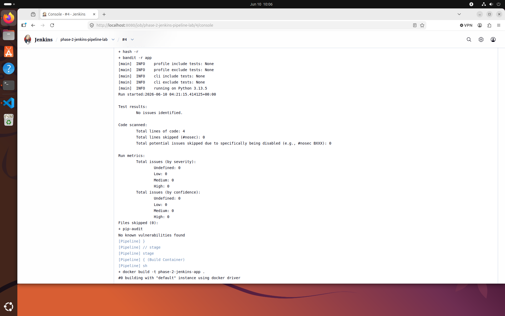
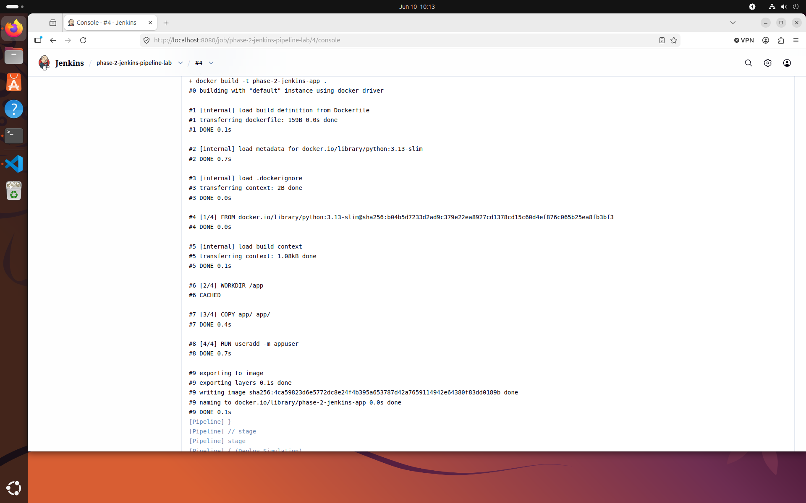
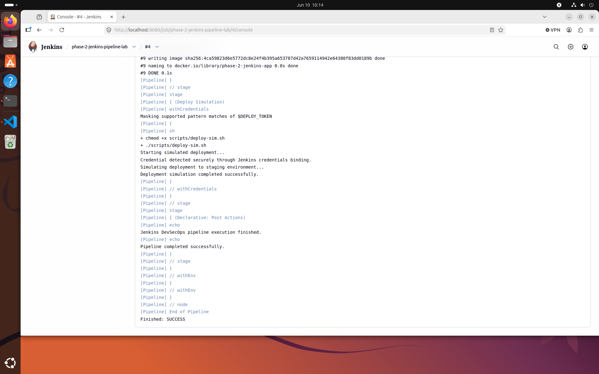
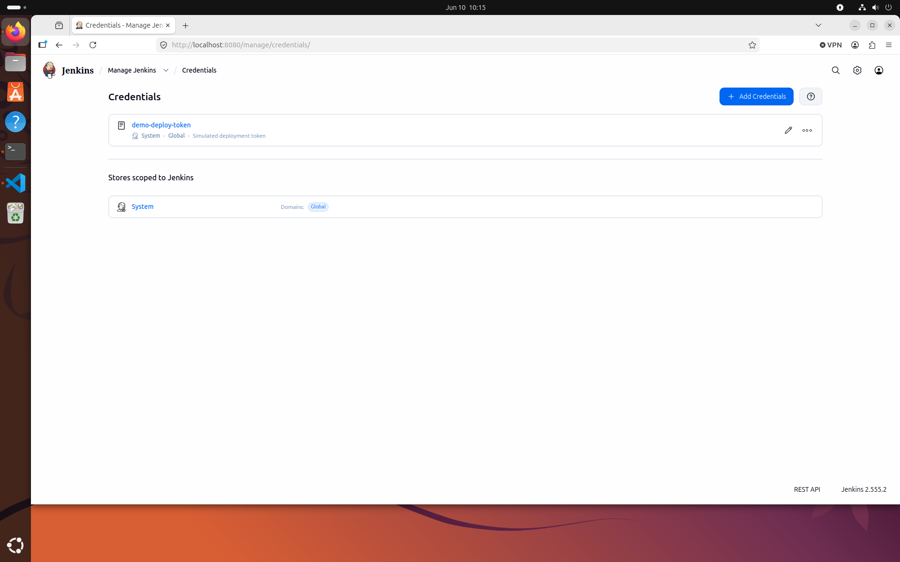
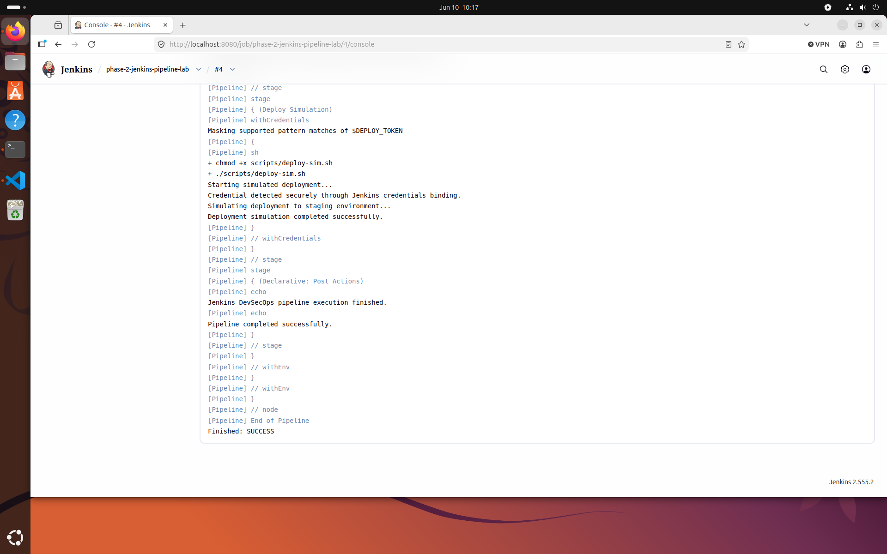

# Phase 2 – Jenkins Pipeline Lab

A production-inspired **DevSecOps CI/CD pipeline** demonstrating secure automation using **Jenkins**, **Docker**, **Python**, and **Pipeline as Code**.

This project showcases how automated testing, static analysis, security scanning, containerization, and deployment simulation can be integrated into a modern CI/CD workflow.

---

# Objectives

The primary goals of this project are to:

* Learn Jenkins Pipeline as Code using a `Jenkinsfile`
* Build and execute automated CI/CD pipelines
* Integrate automated testing into the build process
* Perform static code analysis and security scanning
* Build container images using Docker
* Demonstrate secure credential handling
* Simulate automated deployments
* Apply DevSecOps best practices in a reproducible environment

---

# Technologies Used

* Jenkins (Dockerized)
* Docker
* Docker Compose
* Python 3.13
* Pytest
* Ruff
* Bandit
* pip-audit
* Git & GitHub
* Ubuntu (VirtualBox)
* Visual Studio Code

---

# Pipeline Stages

The Jenkins pipeline performs the following stages:

1. Checkout
2. Install Dependencies
3. Lint (Ruff)
4. Automated Testing (Pytest)
5. Security Scan (Bandit & pip-audit)
6. Docker Image Build
7. Deployment Simulation

---

# Features

## Current Features

* Dockerized Jenkins controller
* Pipeline as Code (`Jenkinsfile`)
* Automated dependency installation
* Ruff linting
* Pytest execution
* Bandit static security analysis
* pip-audit dependency scanning
* Docker image creation
* Simulated deployment stage
* Jenkins credential integration
* Documentation and sample outputs

## Future Enhancements

* Trivy container image scanning
* SBOM generation
* GitHub Webhook automation
* Kubernetes deployment
* OWASP Dependency-Check
* Automated artifact publishing
* Multi-environment deployments

---

# Repository Structure

```text
phase-2-jenkins-pipeline-lab/
├── app/
├── docs/
│   ├── architecture.md
│   ├── credential-handling.md
│   └── plugin-security-notes.md
├── jenkins/
│   ├── Dockerfile
│   └── plugins.txt
├── sample-output/
├── screenshots/
├── scripts/
├── tests/
├── Dockerfile
├── Jenkinsfile
├── docker-compose.yml
├── requirements.txt
└── README.md
```

---

# Running the Project

## Start Jenkins

```bash
docker compose up -d --build
```

Access Jenkins:

```text
http://localhost:8080
```

---

## Run the application locally

```bash
python app/main.py
```

---

## Execute tests

```bash
pytest -v
```

---

## Run linting

```bash
ruff check app tests
```

---

## Execute security scans

```bash
bandit -r app

pip-audit
```

---

## Build the Docker image

```bash
docker build -t phase-2-jenkins-app .
```

---

# Security Considerations

This project demonstrates several DevSecOps practices:

* Pipeline as Code
* Shift-left security
* Automated code quality checks
* Static application security testing
* Dependency vulnerability scanning
* Secure secret handling using Jenkins Credentials
* Minimal container image creation
* Reproducible CI/CD workflows

No credentials or secrets are stored within the source repository.

---

# Documentation

Additional documentation is available in:

* `docs/architecture.md`
* `docs/credential-handling.md`
* `docs/plugin-security-notes.md`

---

# Sample Output

Example outputs generated by this project can be found in:

```text
sample-output/
```

including:

* Jenkins pipeline summary
* Pytest results
* Ruff output
* Bandit report
* pip-audit report
* Docker build output

---

## Screenshots

### Project Structure

Shows the repository layout used for the Jenkins pipeline lab.

```markdown

```

### Jenkins Dashboard

Displays the Jenkins instance with the pipeline project configured.

```markdown

```

### Pipeline Job Page & Stage View

Illustrates successful pipeline execution and stage visualization.

```markdown

```

### Pytest Console Output

Shows successful automated test execution.

```markdown

```

### Ruff Console Output

Shows successful linting using Ruff.

```markdown

```

### Security Scan Console Output

Displays the Bandit and dependency security scanning stage.

```markdown

```

### Docker Build Console Output

Shows the Docker image build initiated by the Jenkins pipeline.

```markdown

```

### Docker Build Success

Confirms successful completion of the Docker image build.

```markdown

```

### Jenkins Credential Binding

Demonstrates secure credential handling. Secret values have been redacted.

```markdown

```

### Deploy Simulation Output

Shows successful execution of the deployment simulation stage.

```markdown

```

---

# Skills Demonstrated

* Jenkins Pipeline as Code
* CI/CD Automation
* DevSecOps Practices
* Docker Containerization
* Python Automation
* Automated Testing
* Static Code Analysis
* Software Composition Analysis
* Secure Credential Management
* Git & GitHub Workflows
* Security-First Development

---

# Disclaimer

This project is intended for educational and portfolio purposes. The deployment stage is simulated and does not deploy to a production environment. Any credentials shown in screenshots are demonstration credentials with sensitive values redacted.
